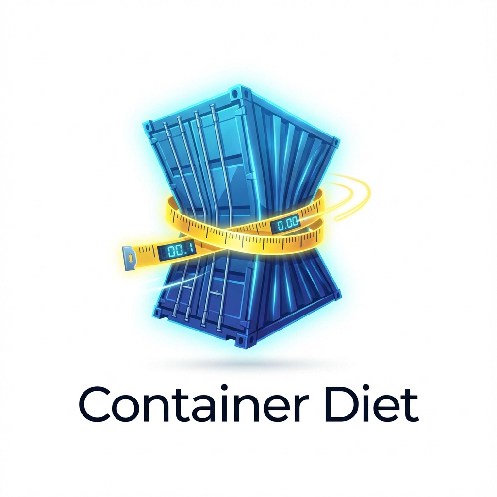

# 🐳 Container Diet CLI

**Slim down your Docker images with the power of AI.**

Container Diet is a futuristic, AI-powered CLI tool that analyzes your Docker images and Dockerfiles to provide actionable, "sassy but helpful" optimization advice. It helps you reduce image size, improve security, and follow best practices.

<div align="center">
  
</div>

## ✨ Features

- **🧠 Multi-Provider AI**: Works with OpenAI, Anthropic, OpenRouter, Ollama, Groq, DeepSeek, Mistral, xAI, and any OpenAI-compatible API. Bring your own key or run locally.
- **🔌 MCP Server**: Expose Container Diet as a tool for Claude Desktop, Cursor, Codex, and any MCP-compatible AI agent. Analyze Dockerfiles and images directly from your editor.
- **🐳 Docker-Themed UI**: Beautiful CLI output with Docker-brand colors and nautical icons.
- **🏠 Flexible Image Source**: Analyze local daemon images, pull remote images with `--remote`, or auto-pull missing local images with `--pull-missing`.
- **🛡️ Security Focused**: Detects root user violations, exposed secrets, and unnecessary packages.
- **🛠️ Auto-Fix**: Automatically generate an optimized version of your Dockerfile with the `--auto-fix` flag.
- **📊 JSON Output**: Machine-readable `--format json` for CI/CD pipelines and automated auditing.
- **🎭 "Container Dietician" Persona**: Enjoy entertaining, roast-style feedback that keeps optimization fun.

## 🚀 Installation

### Prerequisites

- Go 1.21+
- Docker daemon running locally (required for local image analysis)
- Optional: Podman via Docker-compatible API socket
- An API key for at least one AI provider (OpenAI, Anthropic, OpenRouter, Ollama, etc.)

### Install via Go

```bash
go install github.com/k1lgor/container-diet/cmd/cli@latest
```

### Build from Source

```bash
git clone https://github.com/k1lgor/container-diet.git
cd container-diet
go mod tidy
go build -o container-diet cmd/cli/main.go
```

## ⚙️ Configuration

You must configure at least one AI provider before running the tool.

**Quick start:**
```bash
container-diet init-config
# Edit ~/.config/container-diet/config.yaml — uncomment a provider, set api_key and default_model
```

Or set an environment variable (example for OpenAI):

**Linux/macOS:**
```bash
export OPENAI_API_KEY="sk-..."
```

**Windows (PowerShell):**
```powershell
$env:OPENAI_API_KEY="sk-..."
```

Supported providers: OpenAI, Anthropic, OpenRouter, Ollama, Groq, DeepSeek, Mistral, xAI, Perplexity, Moonshot, Hugging Face, or any OpenAI-compatible custom endpoint.

## 📖 Usage

### Analyze a Local Image

```bash
container-diet analyze my-app:latest
```

### Analyze with Dockerfile Context

Providing the Dockerfile gives the AI more context for better suggestions.

```bash
./container-diet analyze my-app:latest --dockerfile Dockerfile
```

### Analyze a Remote Image

Use `--remote` to pull directly from a registry and analyze without requiring a local daemon image.

```bash
./container-diet analyze python:3.9-slim --remote
```

### Pull Missing Local Images Automatically

Use `--pull-missing` to keep local-first behavior, but auto-pull if the image is missing locally.

```bash
./container-diet analyze busybox --pull-missing
```

### 🛠️ Automatically Generate Fixes (Auto-Fix)

The most powerful feature! Use `--auto-fix` to have the Container Dietician write the optimized Dockerfile for you.

```bash
./container-diet analyze --dockerfile Dockerfile --auto-fix
```

This will generate a `Dockerfile.diet` file in the same directory. You can then compare it with your original and apply the improvements. **Works even without a source Dockerfile** by reverse-engineering the image layers!

### Podman Compatibility

For local analysis with Podman, expose Podman's Docker-compatible API socket and set `DOCKER_HOST` to it.

### Full Help

```bash
./container-diet analyze --help
```

## 🎮 Demo Output

Here is what happens when you feed the **"Nightmare Monolith"** Dockerfile to the Container Dietician:

**Command:**

```bash
./container-diet analyze --dockerfile samples/Dockerfile.nightmare
```

**Output:**

```text
Reading Dockerfile: samples/Dockerfile.nightmare...

🐳 [AI ANALYSIS COMPLETE]
Asking the Container Dietician for insights... 🚢

Oh, honey, what do we have here? A "Monolith Monster" Dockerfile that's about to sink your ship
with its fatty layers and spicy security risks! Let’s roll up our sleeves and clean this galactic
mess. 🚀

---

⚠ WARNING: Version Drift Alert!
You've got a "fluffy" problem right at the start, darling! Using `ubuntu:latest` means you're
playing roulette with your build environment. 🎰

✓ SUGGESTION: Pin your base image to a specific version like `ubuntu:22.04` to keep things
predictable.

---

⚠ WARNING: Apt-get Avalanche!
Installing just about everything but the kitchen sink, are we? This is the definition of bloat,
my dear. 🐘

✓ SUGGESTION: Install only what's necessary for your app. Consider slimming it down by ditching
`openjdk-11-jdk`, `build-essential`, `cmake`, and `gdb` unless you truly need them. Otherwise,
you're just hoarding bytes.

---

⚠ WARNING: Hazardous Permissions Play!
777 permissions? I hope you’re wearing a hard hat! This is a security risk as wide as a black
hole. 🌌

✓ SUGGESTION: Use more restrictive permissions. Typically, `chmod -R 755` or `chmod -R 644`,
depending on what’s needed for executing.

---

⚠ WARNING: Root Cabal Alert!
Running SSH as root with root login permitted? You might as well hand over the keys to the
universe. 🔑

✓ SUGGESTION: Disable root login and use a non-root user. Also, ask yourself—do you really need
SSH in a container? Usually, it's a sign you need to rethink your strategy.

---

Oh, darling, let’s trim down that bloated ship before it swallows a sun. Your future workloads
will thank you for the speed and safety tunes! Now, get to work, 🛠️ and remember: less is always
more. 🐳✨
```

## 🏗️ Project Structure

- `cmd/cli`: Main entry point for the CLI.
- `internal/cli`: CLI command definitions and logic (analyze, init-config, mcp).
- `internal/ai`: Multi-provider AI integration (Anthropic, OpenAI-compatible).
- `internal/analyzer`: Core image analysis logic (layers, size, config).
- `internal/config`: YAML configuration with env var expansion and provider setup.
- `internal/mcp`: MCP server exposing tools for AI agents (Claude, Cursor, etc.).
- `samples/`: Collection of Dockerfiles for testing (Light to Nightmare). [See demo outputs](samples/README.md).

## 📄 License

[MIT](LICENSE)
